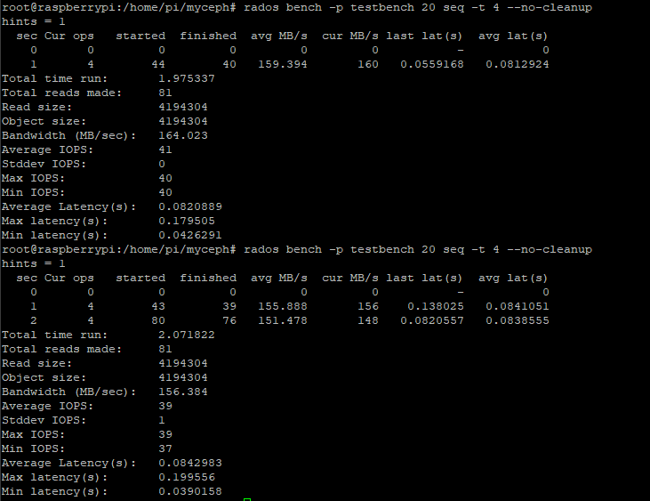

# 单节点性能测试
- Ceph单节点状态：
````
root@raspberrypi:/home/pi/myceph# ceph -s
  cluster:
    id:     f8643fc7-e10c-4073-a985-14ce9259b5bf
    health: HEALTH_OK

  services:
    mon: 1 daemons, quorum raspberrypi
    mgr: raspberrypi(active)
    osd: 3 osds: 3 up, 3 in

  data:
    pools:   0 pools, 0 pgs
    objects: 0 objects, 0B
    usage:   3.00GiB used, 81.0GiB / 84.0GiB avail
    pgs:
````
````
root@raspberrypi:/home/pi/myceph# ceph osd tree
ID CLASS WEIGHT  TYPE NAME            STATUS REWEIGHT PRI-AFF
-1       0.08189 root default
-3       0.08189     host raspberrypi
 0   ssd 0.02730         osd.0            up  1.00000 1.00000
 1   ssd 0.02730         osd.1            up  1.00000 1.00000
 2   ssd 0.02730         osd.2            up  1.00000 1.00000

````
- 使用Ceph内置的Rados工具进行io测试。创建目录个数(pg_num)为128的名为teshbench的存储池：
````
root@raspberrypi:/home/pi/myceph# ceph osd pool create testbench 128 128
````
- 默认配置：
````
root@raspberrypi:/home/pi/myceph# cat ceph.conf
[global]
fsid = f8643fc7-e10c-4073-a985-14ce9259b5bf
mon_initial_members = raspberrypi
mon_host = 192.168.137.21
auth_cluster_required = cephx
auth_service_required = cephx
auth_client_required = cephx

osd pool default size = 1
osd pool default min size = 1
````
- 配置的优化及理论：
    - 更改配置：

````
root@raspberrypi:/home/pi/myceph# cat ceph.conf
[global]
fsid = f8643fc7-e10c-4073-a985-14ce9259b5bf
mon_initial_members = raspberrypi
mon_host = 192.168.137.21
auth_cluster_required = cephx
auth_service_required = cephx
auth_client_required = cephx

osd pool default size = 1
osd pool default min size = 1
mon_allow_pool_delete = true
[osd]
journal_queue_max_ops = 500

osd_max_write_size = 256
osd_client_message_size_cap = 1048576000
osd_recovery_op_priority = 1
osd_recovery_max_activity = 5
rbd_cache_max_dirty = 50331648
rbd_cache_max_dirty_age = 2
rbd_cache_writethrough_until_flush = false 
````
- 说明： 

    - `journal_queue_max_ops` 控制FileJournal中队列的深度，最大未完成日志io数。增加大小能拓展队列深度，提供更大的缓冲余量。 
    - `osd_max_write_size` 是OSD一次可写入的最大值，以sd卡内部分区为介质考虑，适当增加上限。
    - `osd_client_message_size_cap` 是客户端允许在内存中的最大数据，树莓派内存够大，拓宽到1G，能提高cache命中率，对读取有正面作用。
    - `osd_recovery_op_priority` 是恢复操作优先级，取1是极不优先。把cpu的资源占用让给io工作。
    - `osd_recovery_max_activity` 是同一时间内活跃的恢复请求数，同理，降低恢复请求，注重单纯的io工作。
    - `rbd_cache_max_dirty` 是缓存中脏数据的最大值，用来控制回写。如果在测试中对非空存储池再进行写操作，将会提高写速度。
    - `rbd_cache_max_dirty_age` 缓存中单个脏数据的最大缓存时间，这个设定是为了防止脏数据在缓存中持续占用空间，鉴于缓存充足，并且对写延迟没有过分要求，适当增加上限。
    - `rbd_cache_writethrough_until_flush` 该选项是为了兼容linux-2.6.32之前的virtio驱动，避免因为不发送flush请求，数据不回写。raspbian内核版本为5.10.17，直接关闭该选项。
- 使用如下命令来更新配置
```
root@raspberrypi:/home/pi/myceph# ceph-deploy --overwrite-conf admin raspberrypi
```
随后重启
- 默认配置和优化配置的测试对比(固定并发数为4)： 
    - 默认配置，20秒的4M写入测试：
    
    - 优化配置，20秒的4M写入测试：
    
    有略微的写入提升。更多的测试表明写入速度的优化主要由并发数决定，采用4的并发数基本维持每秒16MB的写入。
    - 默认配置，20秒的4M顺序读取测试：
    
    - 优化配置，20秒的4M顺序读取测试：
    
    有略微的带宽提升，平均延迟也有下降。
    注意到，在测试一次顺序读取之后，再进行相同的测试，就会得到：
    
    这种现象说明顺序读取的内容具有良好的结构规律，初次读取之后能调整读取策略（也许是cache更新了），加快重复读取。
    - 默认配置：20秒的4M随机读取测试：
    
    - 优化配置，20秒的4M随机读取测试：
    
    随机读取的速度和优化的顺序读取速度相当。更改配置对随机读取的优化最大。