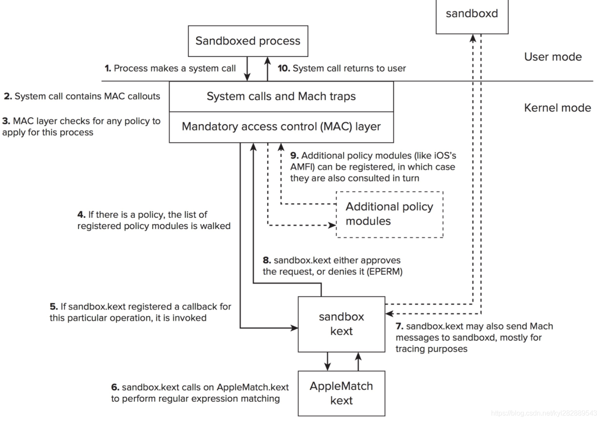

# MacOS Sandbox Report 2021.4.18
## [MacOS沙盒的权限设置](https://developer.apple.com/documentation/security/app_sandbox)
- Essentials：是否使用访问控制技术
- Network：接收和发送网络数据的权限
- Hardware：硬件权限，如照相机
- App Data：访问地址簿，位置，日历的权限
- File Access：其中设置是否拥有访问系统全部文件的权限已被剥离。读写限制十分严格，只有用户主动操作才能实现一般文件的读写（通过脱离程序语境的Powerbox机制——一个选择文件的对话框），否则只有应用程序自己的目录是可见的。下载内容、图片、音乐、电影各有特殊限制规则。

## 应用程序沙盒化
- 在使用苹果的开发软件（如xcode）进行build时启用沙盒并进行沙盒权限确认即可。
- 建立于MacOS沙盒不是程序的义务，但却是上架Mac App Store的必要条件。就算上架MAS，沙盒机制也是可以绕过去的。开发者在商店之外提供一个程序外挂供用户自由安装。由上架MAS的程序指挥外挂进行沙盒外操作即可。

## 沙盒机制
- [2]
- 
- 新的应用程序需要经过初始化。原先的、还未运行过的程序没有被sandbox约束，但是在初始化过程中，如果动态链接器确认了程序启用sandbox，就会根据程序中的权限设置(entitlements)编译出profile。在每次程序运行时，动态链接器都会在应用程序的语境中，根据这个profile初始化沙盒，然后才把控制权递交给程序。
- 流程  
  - 1 进程尝试进行一次系统调用（system call），调用内核功能。  
  - 2、3 MAC层需要根据该进程的安全策略判断此次系统调用是否可以执行。
  - 4、5、6、7、8、9 如果存在策略的话，通过sandbox.kext（提供system call的hook函数）和AppleMatch.kext（解析沙盒的profile）两个内核扩展实现权限的检查。
  - 10 返回调用结果  
- [XPC服务](https://developer.apple.com/library/archive/documentation/MacOSX/Conceptual/BPSystemStartup/Chapters/CreatingXPCServices.html)
  - 是MacOS下的一种IPC(进程间通信)技术, 它实现了权限隔离, 使得App Sandbox更加完备。
  - 将程序隔离成多块能提高稳定性，在某部分crash时，主程序依然运作。
  - 沙盒中应用无法让子进程拥有比自身更高的权限，但是开发者可以设定XPC helpers，它们各自运行在自己的沙盒中并拥有刚好供功能实现所需的权限。实现权限分割，安全性就进一步提高了。
- 和linux下的seccomp有相似之处，即在内核中对system call进行过滤。沙盒初始化就像seccomp程序启用。
## MacOS沙盒的优点
  - 安全性高。不影响性能。
  - 开发者使用方便。
  - 对于用户需求的敏感访问有系统接管办法，如Powerbox。
## MacOS沙盒的缺点
  - 自由度低。非MAS平台的应用，大部分没有采用Sandbox机制。
  - 不可避免的漏洞。 
    - 沙盒在应用程序的语境下初始化，如果程序偶然在沙盒初始化完成前就运行了代码，就存在保护失效的可能性。 事实上bug确实发生了[1]。
    - [在规则内做出背离沙箱的行为](https://objective-see.com/blog/blog_0x39.html)。尽管Apple阻止应用程序注册全局接收分布式通知，但没有任何机制能够阻止沙箱应用程序注册接收任何通知。因此，如果按照名称，注册所有的分布式通知，恶意应用程序可以轻而易举地避开Apple针对沙箱的限制。尽管这需要一些额外的代码来实现，但其带来的影响是造成任何应用程序都可以通过遍历注册，来接收（捕获）到所有分布式通知，包括在沙箱中也是如此。

[1]State of the Sandbox: Investigating macOS Application Security

@inproceedings{inproceedings,
author = {Blochberger, Maximilian and Rieck, Jakob and Burkert, Christian and Mueller, Tobias and Federrath, Hannes},
year = {2019},
month = {11},
pages = {150-161},
title = {State of the Sandbox: Investigating macOS Application Security},
isbn = {978-1-4503-6830-8},
doi = {10.1145/3338498.3358654}
}

[2]The Apple Sandbox

@article{article,
author = {Blazakis, Dionysus},
year = {2011},
month = {02},
pages = {},
title = {The Apple Sandbox}
}